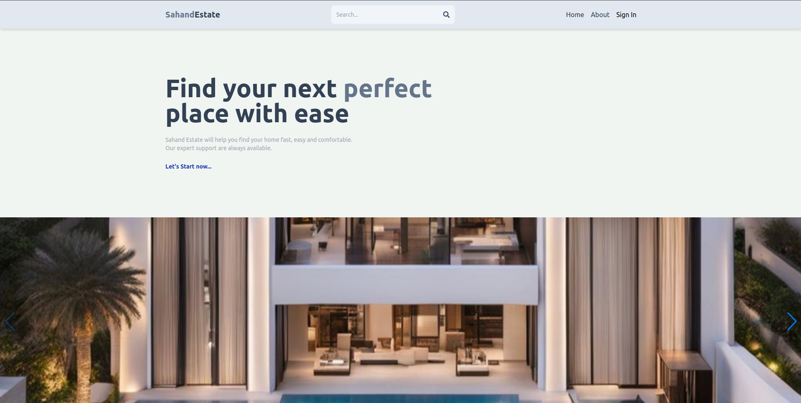
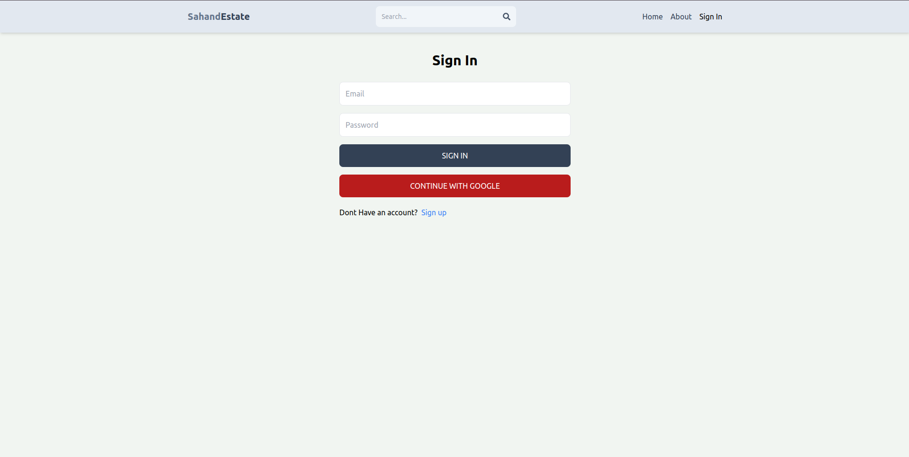
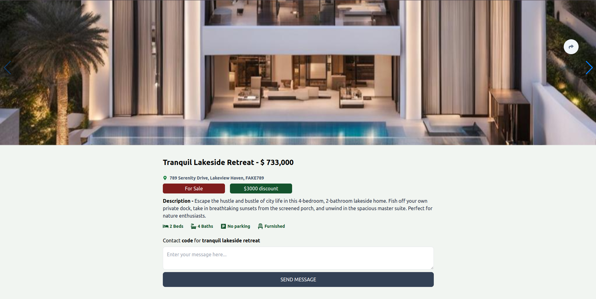

# Project Name

## Overview

This project is a web application designed for real estate market place. It includes both frontend and backend components, built with modern web technologies.


## Setup Instructions

1. Clone the repository:
    ```bash
    git clone https://github.com/Abzaek/mern-estate.git
    cd yourproject
    ```

2. Install dependencies for the backend:
    ```bash
    cd api
    npm install
    ```

3. Install dependencies for the frontend:
    ```bash
    cd ../client
    npm install
    ```

## Running the Application

1. Start the backend server:
    ```bash
    cd api
    npm start
    ```

2. Start the frontend development server:
    ```bash
    cd ../client
    npm run dev
    ```

3. Open your browser and navigate to `http://localhost:3000` to see the application.

## Screenshots

### Landing Page


### Sign-In Page


### Item Page



